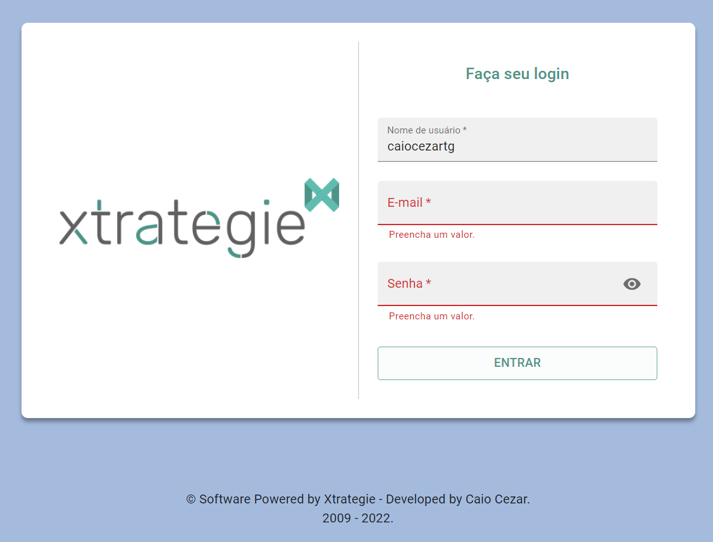

# React XChallenge

<!---Esses são exemplos. Veja https://shields.io para outras pessoas ou para personalizar este conjunto de escudos. Você pode querer incluir dependências, status do projeto e informações de licença aqui--->




> Projeto para o processo seletivo da Xtrategie utilizando ReactJS com a biblioteca Material UI para a estilização e construção dos componentes.

Você pode conferir uma demonstração do projeto <a href="https://react-xchallenge.vercel.app/" target="_blank">aqui</a>.


## 💻 Pré-requisitos

Antes de começar, verifique se você atendeu aos seguintes requisitos:
<!---Estes são apenas requisitos de exemplo. Adicionar, duplicar ou remover conforme necessário--->
* Você instalou a versão mais recente de `ReactJS, NodeJS`
* Você tem uma máquina `Windows, Linux ou Mac`.

## 🚀 Instalando React XChallenge

Para instalar o React XChallenge, siga estas etapas:

Linux e macOS:
```
cd react-xchallenge

npm install OU yarn install
```

Windows:
```
cd react-xchallenge

npm install OU yarn install
```

[⬆ Voltar ao topo](#react-xchallenge)<br>
